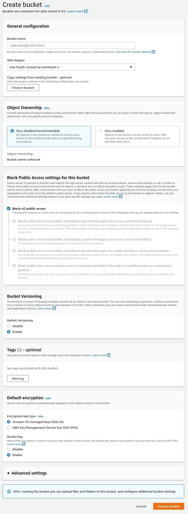

# Terraform

Terraform code example

```
├── terraform
    └── remote-state : Terraform Remote State
```

---

## Terraform Remote State

- tfstate 파일을 공유 가능한 곳에 저장하여 손실 방지 및 협업 시 공유
- DynamoDB를 이용한 lock 관리를 통하여 동시 작업 방지
- AWS, GCP, Azure 등 설정 가능

```
├── remote-state
    ├── backend.conf   : remote state 설정
    ├── env-dev.tfvars : workspace 환경 변수, 각 workspace 별로 생성하여 적용
    ├── variables.tf   : 환경 변수 선언
    └── version.tf     : 기본 설정
```

### AWS S3, DynamoDB를 이용한 backend 설정

#### AWS 설정

##### S3 버킷 생성

- ***과금 대상이므로 테스트 후 삭제***
- Bucket name
  - config 파일에 동일하게 설정
- 암호화 활성



##### DynamoDB에 lock table 생성

- ***과금 대상이므로 테스트 후 삭제***
- Table name
  - config 파일에 동일하게 설정
- Partition key
  - LockID 입력
  - String 선택
- Read/write capacity settings
  - On-demand 선택 : 사용량 기준 비용 정산


#### Terraform 설정

- terraform code directory에서 실행

##### terraform init

```shell
$ terraform init -backend-config=backend.conf

Initializing the backend...

Successfully configured the backend "s3"! Terraform will automatically
use this backend unless the backend configuration changes.

Initializing provider plugins...
- Finding hashicorp/aws versions matching "~> 4.45.0"...
- Installing hashicorp/aws v4.45.0...
- Installed hashicorp/aws v4.45.0 (signed by HashiCorp)

Terraform has created a lock file .terraform.lock.hcl to record the provider
selections it made above. Include this file in your version control repository
so that Terraform can guarantee to make the same selections by default when
you run "terraform init" in the future.

Terraform has been successfully initialized!

You may now begin working with Terraform. Try running "terraform plan" to see
any changes that are required for your infrastructure. All Terraform commands
should now work.

If you ever set or change modules or backend configuration for Terraform,
rerun this command to reinitialize your working directory. If you forget, other
commands will detect it and remind you to do so if necessary.
```

##### terraform 현재 workspace 확인

```shell
$ terraform workspace show
default
```

##### terraform 작업할 workspace 생성

```shell
$ terraform workspace new dev
Created and switched to workspace "dev"!

You're now on a new, empty workspace. Workspaces isolate their state,
so if you run "terraform plan" Terraform will not see any existing state
for this configuration.
```

##### terraform workspace 목록 확인

- 현재 workspace 앞에 \* 표시

```shell
$ terraform workspace list
  default
* dev

```

##### terraform 적용

```shell
# plan
$ terraform plan -var-file=env-dev.tfvars

# apply
$ terraform apply -var-file=env-dev.tfvars

# destroy
# terraform destory -var-file=env-dev.tfvars
```

#### Remote State 동작 확인

- S3 버킷에 tfstate 파일 저장 확인 경로
  - env:
    - 자동 생성
  - terraform workspace
    - 현재 terraform workspace 명
  - config 파일에 설정한 key 항목의 값
    - 설정한 tfstate 파일의 경로 및 파일명


- DynamoDB Table Read/Write 확인


---
